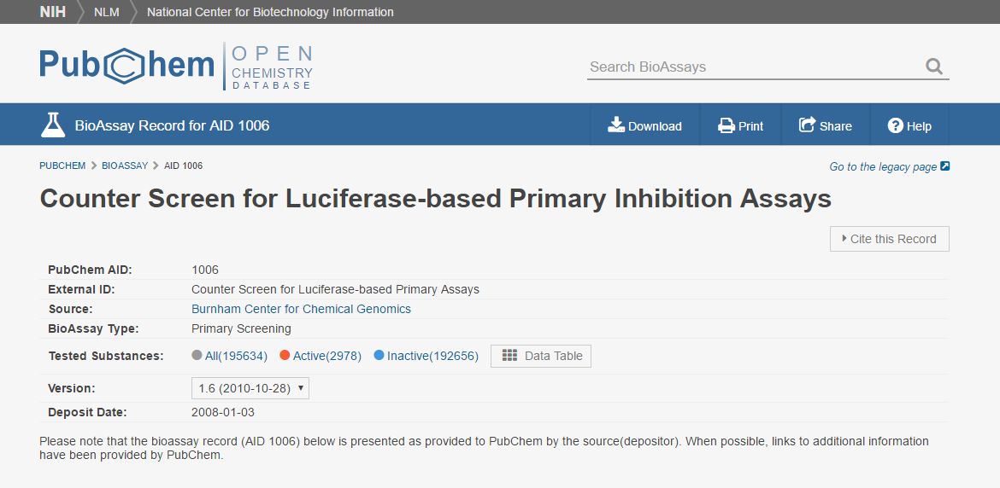
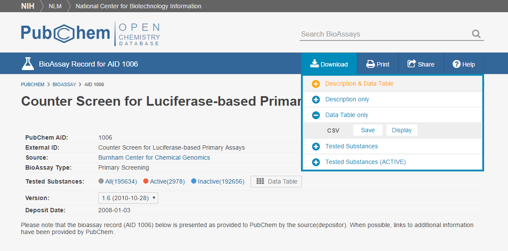
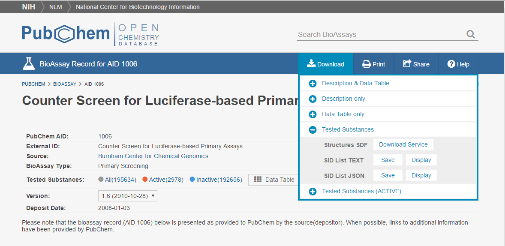

# SDF_Svmlight
convert sdf to svmlight
feature vec: ECFP4 (2048bit)

# requirement
* numpy
* RDKit (https://conda.anaconda.org/rdkit)

# demo
## Go to PubChem assay page.

## Download datatable (csv).

## Download sdf file.

## Run script.

`
python pubchem2svmlight.py pubchem_sdf datatable score_name
`

score_name for example: "%Inhibition at 10 uM"
